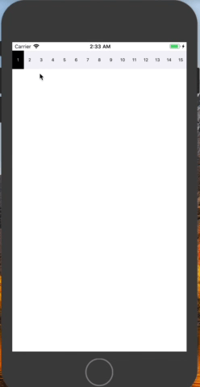
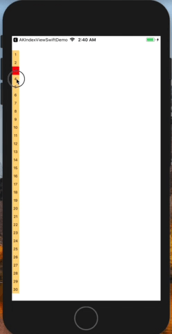

# AKIndexView

[](https://travis-ci.org/Ahmed Khalaf/AKIndexView)
[](https://cocoapods.org/pods/AKIndexView)
[](https://cocoapods.org/pods/AKIndexView)
[](https://cocoapods.org/pods/AKIndexView)

## Example

To run the example project, clone the repo, and run `pod install` from the Example directory first.




## Requirements

## Installation

AKIndexView is available through [CocoaPods](https://cocoapods.org). To install
it, simply add the following line to your Podfile:

```ruby
pod 'AKIndexView'
```

## Author

Ahmed Khalaf, ahmedkhalaf.92@gmail.com

## License

AKIndexView is available under the MIT license. See the LICENSE file for more info.
